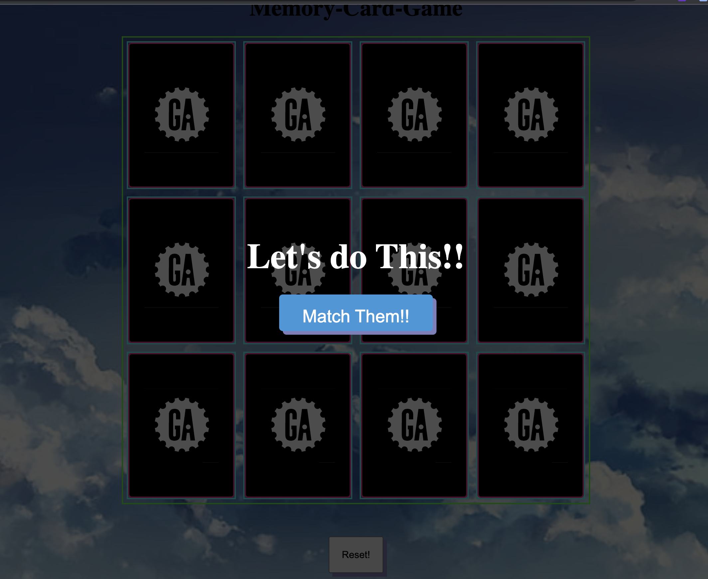
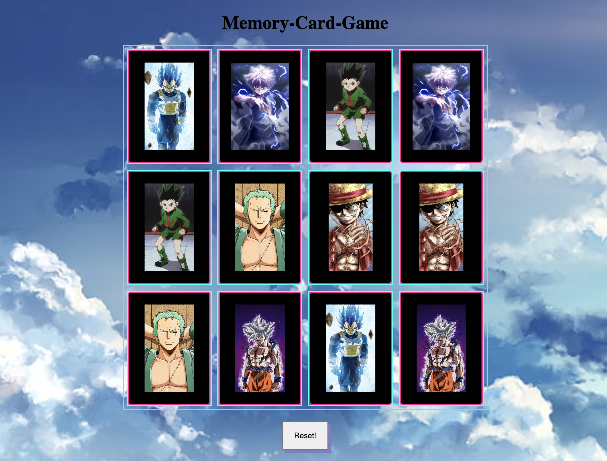

# Memory-Card-Game

## description

- The game starts with all the cards face down and player has to turn over two cards. If the two cards have the same picture, then they keep the cards, otherwise they turn the cards face down again. Win the game when all the card are matched.

## initial image

## all cardes matched 

 ## Technologies Used:

 HTML, JavaScript, CSS.

 ## Getting Started: 
  - Deploy game and match them all!!!

 https://eclectic-shortbread-27bbb8.netlify.app

 ## Next steps

 - Create a victory animation.
 - change the title of the animation once all cards are matched.
 - once the reset is clicked it turna the cards over.

 ## frequent commits
 
 ### Commits on May 12, 2023

- README ready mvp met, some strech goals met

### Commits on May 11, 2023

- mvps met added sounds to first and second click with a victory sound;

 - mvp is in;

 ### Commits on May 10, 2023

- lots of modification;

### Commits on May 9, 2023

- added a reset button & addes the shuffle of the cards;

### Commits on May 8, 2023

- game Layout set;

### Commits on May 7, 2023

- proposal final;
 
### Commits on May 6, 2023

- personal test;
 
### Commits on May 5, 2023

 - first commit;

